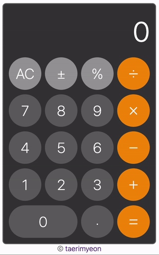
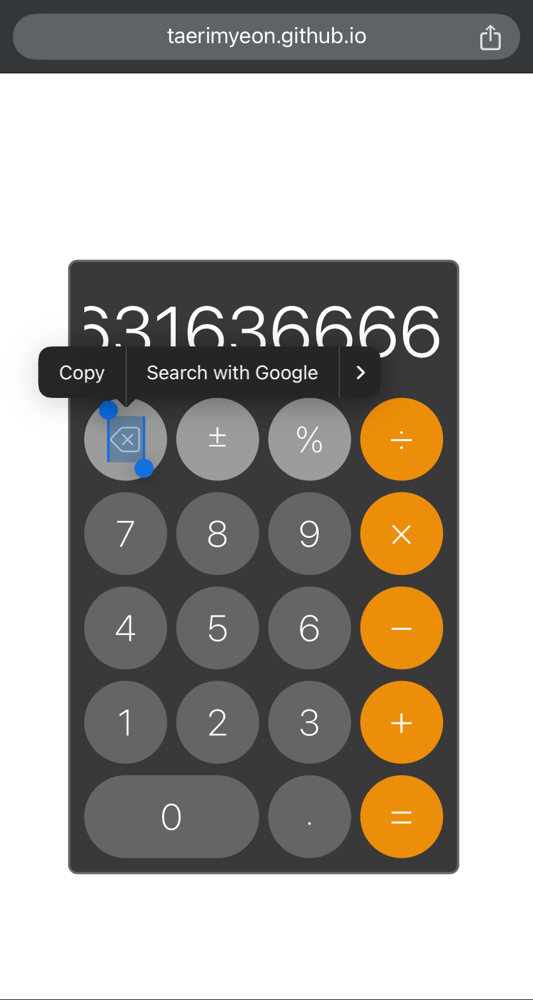
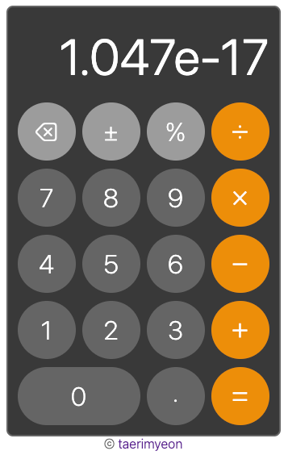
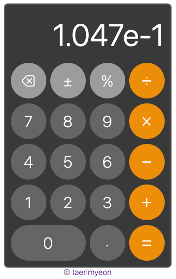

# odin-calculator
The Odin Project: Calculator project repository

# How to Use
## Calculation
This calculator can only calculate two numbers at a time. If the user does not press on `=` button to get the result, pressing another operator will take the result from previous calculation to the next. Thus, chaining the calculation process.  
Users can choose to click on buttons or typing with keyboard when on desktop. To get the same function as pressing `=` button, users can either use `=` or `Enter` keys. As for `±` button, users need to use underscore (by holding `Shift` and followed by `-` keypress). As for `%` button, users need to hold `Shift` and followed by `5` keypress. As for `⌫` button, users need to press `Backspace` key.  
- Single calculation  

- Chaining calculation  

- Calculating with decimal number  

- Calculating with negative number  

## Display Clear
- A single click on `⌫` button to clear one digit at a time (and also mathematical operator, if exists).  

- A click and hold on `⌫` button for about 500ms will clear all previous result and reset the display to zero (performs AC operation).  

# Known Issues
- Tap and holding the `⌫` button in mobile devices won't work the same as desktop would do (it prompts to copy the `⌫` character on the button).  

- Unexpected behavior when deleting number with exponential notation. For example, if we have a number `1.047e-17` and we press the `⌫` button, we should get `1.047e-16` instead of `1.047e-1`.  
  
